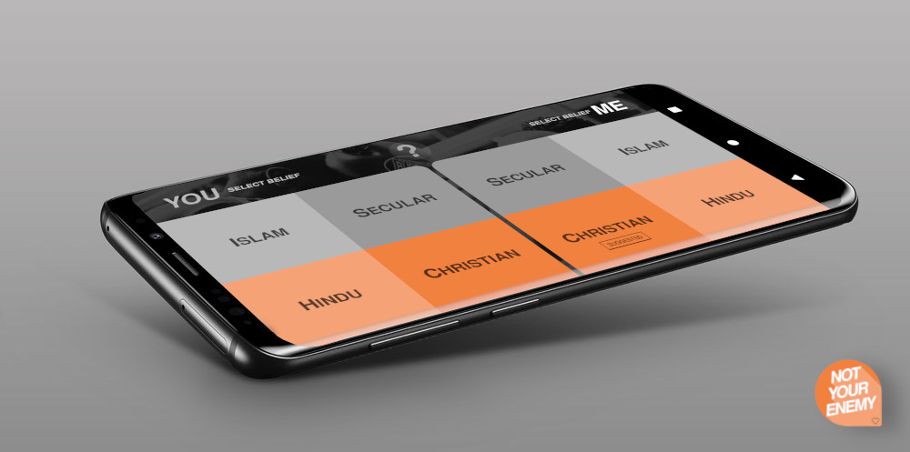

# Not-Your-Enemy

Not Your Enemy (NYE) Outreach Application has gone by many names. It's current name is just our best effort to engage people on the street.  Change it, use it as you wish!  The application itself is a framework for outreach.  If you're like me - a bit of a nerd - you might be an extrovert, but that doesn't mean you always organize your thoughts well sharing the Gospel.  If that's you, than this app is an excellent scaffolding for Gospel Outreach.  It includes an ice breaker question, it has apologetic questions, an analysis of the problems in our world and an in-depth look at our personal culpability before God.

If you want to use this tool to help you stay on track during outreach, feel it would promote engagement or want to use it customize an outreach framework for your culture or region then feel free to use it!

## Release

A build of the application is available - [Not Your Enemy - APK](./RELEASE/not-your-enemy.apk)

You will need to enable the installation of *unknown sources* on your Android device.

## Customization

Much of the structure of Outreach Conversation can not be changed without manually editing the application code.  Apologetic discussions and personal culpability can be changed somewhat by editing their JSON files in the assets folder. JSON *yes* and *no* values represent which slide to proceed to next (the absense of both values indicates and endpoint of a conversation section)

Wording of all slides and all of the ice breaker questions can be edited in the projects default [strings.xml](/app/src/main/res/values/strings.xml) file.

## API (Optional)

NYE has a server-side *PHP* based API in the [API](./API) folder of this release.  This is a simple email routing script (which uses *php-mailer*).  It uses your email provider to forward POST requests to a selected email.  In this manner you can forward basic outreach metrics (interviewee's belief and culpability statement) to your email.

To configure this service, you will need to place the PHP script on your webserver.  The configuration details in the [config.php](./API/config.php) file of the API will need to be filled out with your email service providers details. In the Android project the [strings_config.xml](/app/src/main/res/values/strings_config.xml) file will need to be altered to point to the folder location of your API script.  Once *api_enabled* is set to true in *strings_config.xml* future APK builds will have the Send/Save feature enabled. If this feature is not enabled, the Send/Save buttons in the app will be marked *unavailable*

## License

Free Public License 1.0.0

Permission to use, copy, modify, and/or distribute this software for anypurpose with or without fee is hereby granted.

THE SOFTWARE IS PROVIDED "AS IS" AND THE AUTHOR DISCLAIMS ALL WARRANTIES WITH REGARD TO THIS SOFTWARE INCLUDING ALL IMPLIED WARRANTIES OF MERCHANTABILITY AND FITNESS. IN NO EVENT SHALL THE AUTHOR BE LIABLE FOR ANY SPECIAL, DIRECT, INDIRECT, OR CONSEQUENTIAL DAMAGES OR ANY DAMAGESWHATSOEVER RESULTING FROM LOSS OF USE, DATA OR PROFITS, WHETHER IN AN ACTION OF CONTRACT, NEGLIGENCE OR OTHER TORTIOUS ACTION, ARISING OUT OFOR IN CONNECTION WITH THE USE OR PERFORMANCE OF THIS SOFTWARE.
